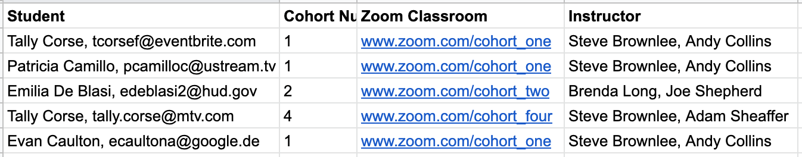
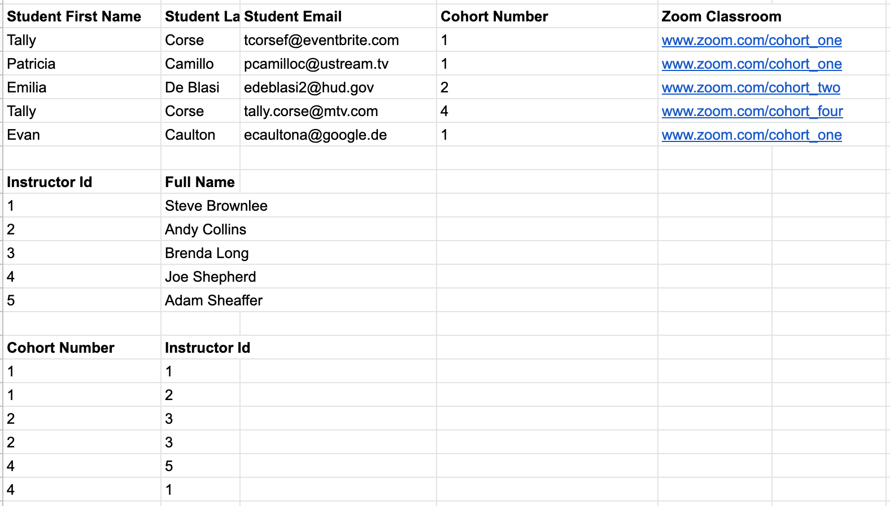
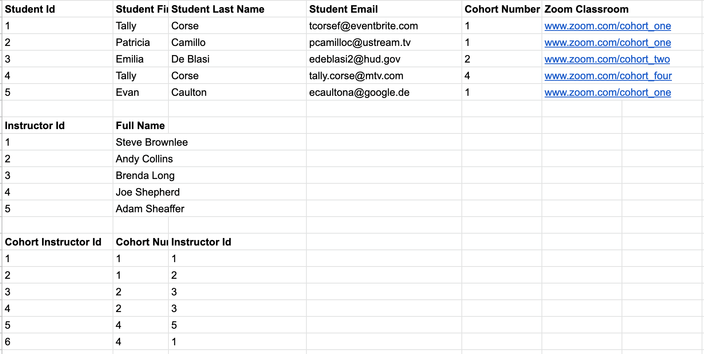
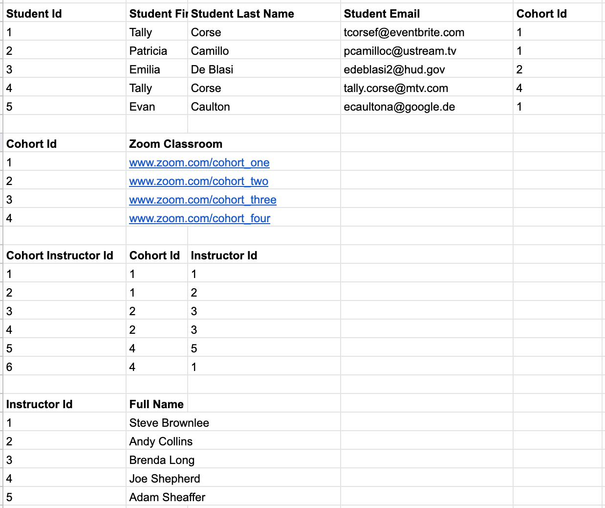

# Database Normalization

Data normalization is a design technique that is used to reduce data redundancy and increase data integrity. This helps to avoid modifying our database as it grows and simplify our queries. 

The three commonly used forms of database normalization are 1st, 2nd and 3rd normal form or 1NF, 2NF and 3NF. There are additonal normal forms but we will not be covering those advanced normal forms.

## Videos to Watch Before Class

1. [Database Tutorial for Beginners](https://www.youtube.com/watch?v=wR0jg0eQsZA)
1. [MicroNugget: How to Normalize Databases](https://www.youtube.com/watch?v=upS2HlUj1gI)
1. [Basic Concept of Database Normalization - Simple Explanation for Beginners](https://www.youtube.com/watch?v=xoTyrdT9SZI)
1. [Beginner SQL - 12 - Normalization - Part 1](https://www.youtube.com/watch?v=0AwcMKR8ijk)
1. [Beginner SQL - 12 - Normalization - Part 2](https://www.youtube.com/watch?v=28kPmHtiWdM)

Normal forms are progressive. This means in order for a database to be considered 3NF, it already meets all requirements for 2NF and 1NF. And in order for a database to qualify for 2NF, it satisfies all the rules for INF.

Here is our initial data before any normalization:

## 1NF

1. The values in each column of a table must be atomic.
1. There are no repeating groups of columns.

Here is our data after we meet the above requirements:

## 2NF

1. Table must be in 1NF.
1. Every non candidate-key attribute must depend on the whole candidate key, not just part of it. This means that the primary key must be a single column.

The data once it satisfies all conditions for 2NF:

## 3NF

1. Table must be in 2NF.
1. The table has no transitive dependencies. A transitive dependency means that if you change the value of a column, the value of another column will also change.

Our normalized database:

## Questions to Discuss in Class

1. What data in Carnival is not normalized?
1. After you identify non-normalized data, have suggestions for what new CSVs should be created to normalize the data.

## Practice: Student Exercises

Given the following [data](./data/normalization_practice/student_exercises.csv), what would it look like in 1NF, 2NF and 3NF?

## Practice: Patients

Normalize the following [data](./data/normalization_practice/patients.csv) so that it meets all requirements for 3NF.
